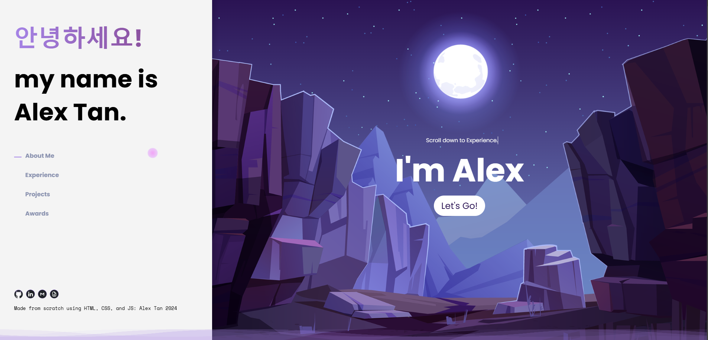

# Personal Portfolio Website

A modern and interactive portfolio website designed to showcase skills, experience, and projects with engaging visuals and responsive design. Built with HTML, CSS, and JavaScript, this website demonstrates advanced web development techniques and creative design elements.

## Features

- **Interactive UI**:
  - Animated greetings in multiple languages using JavaScript.
  - Typewriter effect for dynamic messages.
  - Custom cursor orb that follows the user's mouse movements.
  - Parallax scrolling with layered backgrounds for a 3D effect.

- **Sections**:
  - **About Me**: Highlights background and personal story.
  - **Experience**: Displays professional and academic accomplishments.
  - **Projects**: Showcases key projects with detailed descriptions.
  - **Awards**: Lists recognitions and achievements.

- **Styling and Animations**:
  - Wave animation at the bottom of the page for a visually appealing touch.
  - Smooth transitions and responsive design for desktop and mobile users.

- **Social Integration**:
  - Links to GitHub, LinkedIn, and email.
  - Downloadable resume in PDF format.

## Technologies Used

### Frontend
- **HTML**:
  - Structured content and semantic elements for better accessibility.
- **CSS**:
  - Custom styling with responsive layouts.
  - Animations for waves and parallax scrolling.
- **JavaScript**:
  - Dynamic interactions such as the typewriter effect and cursor animations.
  - Event handling for scroll effects and mouse movements.

### Design
- **Typography**:
  - Google Fonts: "Poppins" and "Space Mono" for a clean, modern look.
- **Graphics**:
  - Custom assets like wave backgrounds and parallax images for immersive design.

## How It Works

1. **Greeting Animation**:
   - Rotates greetings in different languages with a fade-out and slide-in effect.
2. **Custom Cursor**:
   - A glowing orb smoothly follows the user's mouse pointer.
3. **Parallax Scrolling**:
   - Layers of background images move at different speeds for depth perception.
4. **Interactive Navigation**:
   - Navigate between sections using the side panel with smooth scroll effects.

## Purpose

This project serves as a demonstration of web development skills and creative design. It reflects proficiency in building visually appealing, interactive websites using core web technologies.

---

Feel free to explore and share your feedback!

